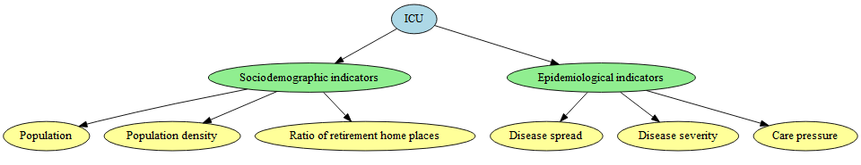

Construction and descriptive COVID-19 databases by health area and day
in Spain[^1]
================
true
2024-04-08

------------------------------------------------------------------------

<style>
.justify-text {
  text-align: justify;
}
</style>

# Structure

- [What to find in this repository?](#what-to-find-in-this-repository?)
- [Hardware and Software](#hardware-and-software)
- [Section 1. Spatial and temporal domains](#section-1-spatial-and-temporal-domains)
  - [1.1 Spatial domains](#11-spatial-domains)
  - [1.2 Temporal domains](#12-temporal-domains)
- [Section 2. Target variable: ICU](#section-2-target-variable-icu)
- [Section 3. Auxiliary Information](#section-3-auxiliary-information)
  - [3.1 Sociodemographic indicators](#31-sociodemographic-indicators)
    - [3.1.1 Population](#311-population)
    - [3.1.2 Population density](#312-population-density)
    - [3.1.3 Ratio of retirement home places](#313-ratio-of-retirement-home-places)
    - [3.1.4 Assessment of socio-demographic indicators](#314-assessment-of-sociodemographic-indicators)
  - [3.2 Epidemiological indicators](#32-epidemiological-indicators)
    - [3.2.1 Disease spread](#321-disease-spread)
    - [3.2.2 Disease severity](#322-disease-severity)
    - [3.2.3 Care pressure](#323-care-pressure)
- [Section 4. Definitive Dataset](#section-4-definitive-dataset)

<div style="text-align: justify;">

## What to find in this repository?

</div>

<div style="border: 2px solid #00B050; padding: 10px; background-color: #D9F4E3; text-align: center; text-align: justify;">

<p>
This repository includes the dataset created from scratch for the
research embodied in the paper **Analyzing the COVID-19 intensive care
unit bed occupancy with random regression coefficient Poisson models**.
Each of the phases required for its construction are specified below,
with the source and intermediate files attached, in addition to the
final file on which the results included in the paper are based. If any
user has any doubts or curiosity, please contact the first author.
</p>

</div>

<div style="text-align: justify;">

## Hardware and Software

</div>

<div style="border: 2px solid red; padding: 10px; background-color: lightyellow;">

<p style="margin: 0;">
It is recommended to download the repository and to indicate in path the
directory where the folders are stored, to facilitate the execution.
</p>

``` r
path<-"D:/COVID_DATA"
setwd(path)
```

</div>

<div style="text-align: justify;">

There are no special hardware requirements for data handling. For
reference, the construction of the dataset was carried out on a computer
with a 7-core processor, with a RAM of 16.0 GB and a maximum processor
speed of 1.50 GHz. As for the software, the operating system was Windows
10 and both the creation and reading of the datasets was done with the R
programming language (version 4.2.2 and higher), highlighting the
following packages for reading and handling the data.

</div>

``` r
# Reading csv files in R, especially recommended for large data volumes.
if(!require(data.table)){
  install.packages("data.table",dependencies=TRUE)
  library(data.table)
}

# Dynamic reporting.
if(!require(knitr)){
  install.packages("knitr",dependencies=TRUE)
  library(knitr)
}
```

<div style="text-align: justify;">

# Section 1. Spatial and temporal domains

</div>

<br>
<p>

<div style="border: 2px solid black; padding: 10px; background-color: #EAFCEA;text-align: justify;">

The main objective of this research is to **estimate and predict the
count and proportions of intensive care unit (ICU) beds occupied by
COVID-19 patients** by health area and day in Castilla y León.

</div>

</p>
<br>
<p>
<div style="text-align: justify;">

## 1.1 Spatial domains

<div style="border: 2px solid #00B050; padding: 10px; background-color: #D9F4E3; text-align: center; text-align: justify;">
<p>

The data files and images referenced in this section are located in the
**HEALTH AREAS** folder, and correspond to:

- **municipality_health_areas.csv**: file corresponding to the
  equivalences between municipalities and health areas or H.A.
- **mapSpainCL.png**: image represented in [Figure 1](#fig:mapSpain).
- **mapCastillaLeon.png**: image represented in [Figure
  2](#fig:healthareaCL).
  </p>
  </div>

</div>

<div style="text-align: justify;">

The domains or spatial areas of interest correspond to the Health Areas
(H.A.) of Castilla y León, an Autonomous Community in Spain, located, as
can be seen in [Figure 1](#fig:mapSpain), in the north-western fringe of
the Peninsula.

</div>

<div id="fig:mapSpain" class="figure" style="text-align: center;">


<p class="caption">
Figure 1: Geographical location of Castilla y León.
</p>

</div>

The spatial domains of interest correspond to its 11 H.A., as shown in
[Figure 2](#fig:healthareaCL).

<div id="fig:mapCastillaLeon" class="figure"
style="text-align: center;">


<p class="caption">
Figure 2: H.A. of Castilla y León.
</p>

</div>

<div style="text-align: justify;">

To define the correspondence between the H.A. and the municipalities
they cover, we consulted

</div>

- [Territorial Health Planning in the Autonomous Communities
  2021](https://www.sanidad.gob.es/estadEstudios/estadisticas/docs/siap/Ordenacion_sanitaria_2021.pdf)
- [Castilla y León Health Planning
  Guide](https://www.saludcastillayleon.es/institucion/es/organizacion/ordenacion-sistema-sanitario/guia-ordenacion-sanitaria-castilla-leon)

<div style="text-align: justify;">

As a result, we obtain the file **municipality_health_areas.csv** with
the H.A-municipalities correspondence, attached in the **HEALTH AREAS**
folder and whose header is illustrated below. Specifically, there are
2248 rows and 7 columns.This corresponds to the 2248 municipalities in
Castilla y León and the following variables:

</div>

- **ID_HA**: Official H.A. identifier code.
- **HA**: Name of the H.A.
- **Municipality**: Name of the municipality
- **ID_INE**: Official code of the municipality in the INE (Instituto
  Nacional de Estadística).
- **ID_Municipality**: Municipality identifier in the file.
- **Province**: Province in which the municipality is located.
- **ID_province**: Official code of the province that appears in the
  INE.

``` r
# Load the data.table library
library(data.table)

# Read csv file
data <- as.data.frame(fread("./HEALTH AREAS/municipality_health_areas.csv"))

# Display the file header
head(data)
```

    ##   ID_HA          HA                Municipality ID_INE ID_Municipality Province
    ## 1  1702 H.A. BURGOS        SALINILLAS DE BUREBA   9334             334   BURGOS
    ## 2  1702 H.A. BURGOS       SAN ADRIAN DE JUARROS   9335             335   BURGOS
    ## 3  1702 H.A. BURGOS          SAN JUAN DEL MONTE   9337             337   BURGOS
    ## 4  1702 H.A. BURGOS               SANTA CECILIA   9343             343   BURGOS
    ## 5  1702 H.A. BURGOS    SANTA CRUZ DE LA SALCEDA   9345             345   BURGOS
    ## 6  1702 H.A. BURGOS SANTA CRUZ DEL VALLE URBION   9346             346   BURGOS
    ##   ID_Province
    ## 1           9
    ## 2           9
    ## 3           9
    ## 4           9
    ## 5           9
    ## 6           9

## 1.2 Temporal domains

<div style="text-align: justify;">

The temporal domains of interest correspond to **488 consecutive days**
for each H.A., collected from **2 November 2020 to 6 March 2022**. Of
this total, it should be specified that the 181 days between 2 November
2020 and 2 May 2021 are used to assess the adjustment capacity of the
model. On the other hand, the remaining 307 days, from 3 May 2021 to 6
March 2022, are used to assess the quality of the forward forecast with
data that have not been used in the model fit.

According to the [Centro Nacional de Epidemiología
(CNE)](https://www.isciii.es/QueHacemos/Servicios/VigilanciaSaludPublicaRENAVE/EnfermedadesTransmisibles/Documents/INFORMES/Informes%20COVID-19/INFORMES%20COVID-19%202022/Informe%20n%C2%BA%20154%20Situaci%C3%B3n%20actual%20de%20COVID-19%20en%20Espa%C3%B1a%20a%2011%20de%20noviembre%20de%202022.pdf),
a total of five epidemic periods (EP) occurred during this time range.

- **Second epidemic period (2nd EP)**: Between 22 June 2020 and 6
  December 2020, at which point the 14-day CI (Cumulative Incidence)
  tipping point of COVID-19 cases occurs, leading to the third period.
- **Third epidemic period (3rd EP)**: Between 7 December 2020 and 14
  March 2021, when the 14-day CI tipping point of COVID-19 cases occurs,
  leading to the fourth period.
- **Fourth epidemic period (4th EP)**: Between 15 March 2021 and 19 June
  2021, when the 14-day CI turning point of COVID-19 cases occurs,
  leading to the fifth period.
- **Fifth epidemic period (5th EP)**: Between 20 June 2021 and 13
  October 2021, when the 14-day CI tipping point for COVID-19 cases
  occurs, leading to the sixth period.
- **Sixth epidemic period (6th EP)**: Between 14 October 2021 and 27
  March 2022, the last day before the implementation of a new
  epidemiological surveillance strategy.

In the same vein, the 488 days under study allow to take into
consideration the impact of three main SARS-CoV-2 variants, which were
considered by the European Centre for Disease Prevention and Control as
Variants of Concern (VOC) for their significant epidemiological impact:
Alpha (B.1.1.7), Delta (B.1.617.2) and Omicron (B.1.1.529).

</div>

<div style="text-align: justify;">

# Section 2. Target variable: ICU

</div>

<p>

<div style="border: 2px solid black; padding: 10px; background-color: #EAFCEA;text-align: justify;">

The target variable of the model is the count of people hospitalised
with COVID-19 in ICU.

The data file referenced in this section is located in the **ICU**
folder, and corresponds to:

- **ICU.csv**: File containing the number of people with suspected
  COVID-19 admitted to ICU by H.A. and day.

</div>

</p>

<div style="text-align: justify;">

For its construction, we carry out the following steps:

- We consulted the Open Data portal of the Junta de Castilla y León. We
  downloaded the database [“Situation of hospitalised patients with
  Coronavirus in Castilla y
  León”](https://analisis.datosabiertos.jcyl.es/explore/dataset/situacion-de-hospitalizados-por-coronavirus-en-castilla-y-leon/information/?flg=es-es&sort=fecha).
  In this database, we have records at **hospital level**, indicating,
  for a total of 15 hospitals in the Autonomous Community, the number of
  patients in ICU due to COVID-19. These patients, in accordance with
  the guidelines of the Ministry of Health, are counted both for having
  a positive diagnostic test or for a high clinical suspicion of the
  disease. In addition, they specify that those hospitalised in ICU
  include: ICU, REA (resuscitation units), URPA (post-anaesthesia
  resuscitation units) and other units with adequate staffing for
  critical patients.

- We carried out a search for the H.A. to which each hospital belongs,
  using the [IdeCyL
  viewer](https://idecyl.jcyl.es/vcig/?service=https://idecyl.jcyl.es/geoserver/hh/wms&layer=salud_cyl_zonas_basicas_v&type=wms&style=hh%3Asalud_cyl_zonas_basicas_oscuro&bbox=160000,4440000,605000,4790000&srs=EPSG:25830),
  the [Health centre
  finder](https://buscadorcentros.saludcastillayleon.es/BUCE/) and the
  [Castilla y León Health Planning
  Guide](https://www.saludcastillayleon.es/institucion/es/organizacion/ordenacion-sistema-sanitario/guia-ordenacion-sanitaria-castilla-leon).
  The correspondence is as follows:

  - H.A. El Bierzo: Hospital El Bierzo.
  - H.A. León: Complejo Asistencial Universitario de León.
  - H.A. Palencia: Complejo Asistencial Universitario de Palencia.
  - H.A. Burgos: Hospital Santos Reyes; Complejo Asistencial
    Universitario de Burgos; Hospital Santiago Apóstol.
  - H.A. Soria: Complejo Asistencial de Soria.
  - H.A. Segovia: Complejo Asistencial de Segovia.
  - H.A. Ávila: Complejo Asistencial de Ávila.
  - H.A. Salamanca: Complejo Asistencial Universitario de Salamanca.
  - H.A. Valladolid Este: Hospital Cínico Universitario de Valladolid;
    Edificio Rondilla.
  - H.A. Valladolid Oeste: Hospital Universitario Río Hortega; Hospital
    Medina del Campo.
  - H.A. Zamora: Complejo Asistencial de Zamora.

- We checked the available time range to see if there are observations
  for all the days between **02/11/2020 and 06/03/2022**. Thus, we find
  that data are missing for four dates, corresponding to the following
  days: Saturday 3 July 2021, Sunday 4 July 2021, Saturday 10 July 2021,
  and Sunday 11 July 2021. To perform the imputation of these four
  missing occupancy values, we rely on the data available for these
  dates in:

  - [COVID-19 risk indicators by provinces up to
    24-03-22](https://analisis.datosabiertos.jcyl.es/explore/dataset/indicadores-de-riesgo-covid-19-por-provincias/table/?disjunctive.indicador&sort=fecha)
  - [COVID-19 risk indicators by municipalities until
    24-03-2022](https://analisis.datosabiertos.jcyl.es/explore/dataset/indicadores-de-riesgo-covid-19-por-municipios/table/?disjunctive.provincia&sort=fecha)

- Once the allocation of the H.A. of each hospital has been carried out
  and with the target time range complete, the aggregation of those
  hospitalised in ICU is carried out, by H.A. and day, saved in the
  **ICU** csv file, the header of which can be seen below.

</div>

``` r
# Load the data.table library
library(data.table)

# Read csv file
data <- as.data.frame(fread("./ICU/ICU.csv"))

# Display the file header
head(data)
```

    ##         date         HA ID_HA province ICU
    ## 1 02/11/2020 H.A. ÁVILA  1701    Ávila   9
    ## 2 03/11/2020 H.A. ÁVILA  1701    Ávila   9
    ## 3 04/11/2020 H.A. ÁVILA  1701    Ávila   9
    ## 4 05/11/2020 H.A. ÁVILA  1701    Ávila   7
    ## 5 06/11/2020 H.A. ÁVILA  1701    Ávila   9
    ## 6 07/11/2020 H.A. ÁVILA  1701    Ávila   9

<div style="text-align: justify;">

# Section 3. Auxiliary Information

</div>

<div style="text-align: justify;">

Since the target variable is occupancy in ICU due to COVID-19, we looked
at factors that could influence it, classifying them into two large
blocks: **sociodemographic factors** and **epidemiological factors**, as
shown in the diagram.

<div style="position: relative;">
  
  <a href="#31-sociodemographic-indicators" style="position: absolute; top: 44.8649%; left: 24.6875%; width: 23.125%%; height: 100%;"></a>
  <a href="#311-population" style="position: absolute; top: 0; left: 33%; width: 33%; height: 100%;"></a>
  <a href="#312-population-density" style="position: absolute; top: 0; left: 66%; width: 34%; height: 100%;"></a>
</div>


</div>

<div style="margin-top: -300px; margin-bottom: -300px;">

<!-- -->

</div>

## 3.1 Sociodemographic indicators

<div style="text-align: justify;">

We proceeded to characterise the H.A. on the basis of sociodemographic
factors such as population, population density and the ratio of nursing
home places per 100 inhabitants over 65 years of age.
</div>

> [!NOTE]
> The data files referenced in this section are located in the **SOCIODEMOGRAPHIC INDICATORS** folder and correspond to:
> - **ORIGINAL SOURCES**: Folder containing the original data files downloaded from each source web page referenced. Specifically:
>   - - **population_municipalities.csv**: Data file of the Instituto Nacional de Estadística (INE) corresponding to 2021 Population and Housing Census, containing information on the [2021 Population by sex, municipalities, nationality (Spanish/foreign) and age (large groups)](https://ine.es/jaxiT3/Tabla.htm?t=33571&L=0).
>   - - **surface_municipalities.csv**: Data file of the Instituto Geográfico Nacional (IGN), specifically the [“Geographic Nomenclator of Municipalities and Population Entities”](https://www.ign.es/web/rcc-nomenclator-nacional.) showing the geographical surface of each territory.
>   - - **retirement home_places.csv**: Data files from the open data portal [“Envejecimiento en Red”](https://envejecimientoenred.csic.es/datos-abiertos/residencias/), detailing, for each province, the existing old people’s homes, as well as their number of places and municipal location.
>       - **retirement home_places_avila.csv**
>       - **retirement home_places_burgos.csv**
>       - **retirement home_places_leon.csv**
>       - **retirement home_places_palencia.csv**
>       - **retirement home_places_salamanca.csv**
>       - **retirement home_places_segovia.csv**
>       - **retirement home_places_soria.csv**
>       - **retirement home_places_valladolid.csv**
>       - **retirement home_places_zamora.csv**
> - **sociodemographic_indicators.csv**: csv file constructed with all the sociodemographic indicators contemplated by H.A. (population, population density and rate of number of retirement home home places per 100 people over 65 years of age).


</p>

### 3.1.1 Population

<div style="text-align: justify;">

In order to deepen the analysis, we aimed to obtain the total population
for each H.A., but also the proportion of women, men, people under 16,
between 16 and 64 and over 65 years.

- Firstly, we extracted the information from the INE’s 2021 Population
  and Housing Census, and specifically, from the results of [“2021
  Population by sex, municipalities, nationality (Spanish/foreign) and
  age (large groups)”](https://ine.es/jaxiT3/Tabla.htm?t=33571&L=0). We
  chose 2021, since our range of interest is between 2020 and 2022, and
  the population figures are known in January of the year after the
  current one. It is therefore the most consistent year, of those then
  available, to take into consideration the population effect of
  COVID-19 in 2020.
- We then define the following variables:
  - **POP_2021**: Total number of inhabitants per H.A.
  - **sex0**: Base 1 proportion of the number of men.
  - **sex1**: Base 1 proportion of the number of women.
  - **cit0**: Base 1 proportion of the number of persons with Spanish
    nationality or dual nationality (one of them Spanish).
  - **cit1**: Base 1 proportion of the number of persons without Spanish
    nationality.
  - **age0**: Base 1 proportion of persons under 16 years of age.
  - **age1**: Base 1 proportion of persons aged between 16 and 64 years
    of age.
  - **age2**: Base 1 proportion of persons aged over 64 years.
- Finally, to obtain the values of the variables, we aggregate, for each
  H.A., the information collected by the INE at the municipality level.

</div>

### 3.1.2 Population density

<div style="text-align: justify;">

The population density for each H.A. is defined as the number of people
per km<sup>2</sup> of surface area. To obtain it, we carry out the
following steps.

- We consulted the Instituto Geográfico Nacional (IGN), specifically the
  [“Geographic Nomenclator of Municipalities and Population
  Entities”](https://www.ign.es/web/rcc-nomenclator-nacional), which,
  based on the Register of Local Entities, the INE and the IGE’s own
  cartographic databases, provides, among other characteristics, the
  surface area of each municipality in km<sup>2</sup>.
- Once this information was downloaded, the next step was to add the
  surface area by H.A., and finally to calculate the population/surface
  area ratio to obtain the population density.

</div>

### 3.1.3 Ratio of retirement home places

<div style="text-align: justify;">

One of the keys to the COVID-19 pandemic was the severity with which it
affected older people in general, and in particular retirement home care
homes. It is estimated that there should be a minimum of 5 retirement
home care places for every 100 inhabitants over the age of 65. To
calculate this ratio, we need to find the number of places.

- First, we took the data from the Open Data portal [“Envejecimiento en
  Red”](https://envejecimientoenred.csic.es/datos-abiertos/residencias/),
  where the information was located at municipality level.
- Based on the Municipality-H.A. correlation, we aggregated the
  information and calculated the ratio of retirement home places by H.A.

</div>

### 3.1.4 Assessment of sociodemographic indicators

<div style="text-align: justify;">

All variables are combined in the sociodemographic indicators file for
each H.A.

</div>

``` r
# Load the data.table library and the knitr library
library(data.table)
library(knitr)

# Read csv file
data <- as.data.frame(fread("./AUXILIARY INFORMATION/SOCIODEMOGRAPHIC INDICATORS/sociodemographic_indicators.csv"))
                    
data$`H.A.` <- format(data$`H.A.`)
# Display the data file
kable(data)
```

| H.A.                  | POP_2021 |      sex0 |      sex1 |      cit0 |      cit1 |      age0 |      age1 |      age2 | population_density | ratio_retirement_places |
|:----------------------|---------:|----------:|----------:|----------:|----------:|----------:|----------:|----------:|-------------------:|------------------------:|
| H.A. ÁVILA            |   159684 | 0.5028181 | 0.4971819 | 0.9328925 | 0.0671075 | 0.1270134 | 0.6131798 | 0.2598069 |          19.441587 |                8.715983 |
| H.A. BURGOS           |   355031 | 0.4999028 | 0.5000972 | 0.9192916 | 0.0807084 | 0.1354896 | 0.6231709 | 0.2413395 |          25.641513 |                7.731989 |
| H.A. LEÓN             |   324663 | 0.4861256 | 0.5138744 | 0.9520056 | 0.0479944 | 0.1140348 | 0.6076005 | 0.2783647 |          26.122730 |                6.554910 |
| H.A. PALENCIA         |   159720 | 0.4959366 | 0.5040634 | 0.9542575 | 0.0457425 | 0.1188017 | 0.6198660 | 0.2613323 |          19.157662 |               10.263536 |
| H.A. EL BIERZO        |   128167 | 0.4870208 | 0.5129792 | 0.9618154 | 0.0381846 | 0.1047843 | 0.6260143 | 0.2692014 |          35.877389 |                5.747326 |
| H.A. SALAMANCA        |   328242 | 0.4858336 | 0.5141664 | 0.9531626 | 0.0468374 | 0.1200943 | 0.6118017 | 0.2681040 |          26.448208 |                8.347443 |
| H.A. SEGOVIA          |   151440 | 0.5018357 | 0.4981643 | 0.8818814 | 0.1181186 | 0.1388669 | 0.6375462 | 0.2235869 |          22.645145 |                8.603072 |
| H.A. SORIA            |    89458 | 0.5063829 | 0.4936171 | 0.9018209 | 0.0981791 | 0.1292115 | 0.6172170 | 0.2535715 |           8.587615 |               11.100335 |
| H.A. VALLADOLID ESTE  |   266181 | 0.4889718 | 0.5110282 | 0.9414461 | 0.0585539 | 0.1314927 | 0.6234531 | 0.2450541 |          56.317029 |                8.795168 |
| H.A. VALLADOLID OESTE |   253981 | 0.4852646 | 0.5147354 | 0.9490751 | 0.0509249 | 0.1439984 | 0.6303675 | 0.2256341 |          70.593441 |                9.063465 |
| H.A. ZAMORA           |   168658 | 0.4954108 | 0.5045892 | 0.9619644 | 0.0380356 | 0.0996514 | 0.5895540 | 0.3107946 |          16.065885 |                8.207104 |

<div style="text-align: justify;">

The H.A. with the highest number of inhabitants in 2021 correspond to
H.A. Burgos and H.A. Salamanca, while the least populated are H.A. Soria
and H.A. El Bierzo. If we look at the distribution of the population,
the proportion of men and women is very similar, with H.A. Ávila, H.A.
Segovia and H.A. Soria being the only health care areas with more men
than women. In terms of age distribution, the H.A. Valladolid Oeste,
H.A. Segovia, H.A. Burgos and H.A. Valladolid Este stand out as those
with the highest proportion of people under 16 years of age, and H.A.
Zamora as having the lowest proportion of people under 16 years of age.
Thus, the opposite behaviour is observed in terms of the proportion of
the population over 65 years of age, clearly dominating over the rest in
H.A. Zamora, followed by H.A. León and H.A. El Bierzo. In terms of
population density, the H.A. Valladolid Oeste and H.A. Valladolid Este
stand out, with H.A. Soria being by far the health H.A. with the lowest
population density. In no case, however, is the population density of
95.26 inhabitants per km<sup>2</sup> higher than the Spanish average.
Finally, with regard to the ratio of retirement home care home places
per 100 people over 65 years of age, in all H.A. the minimum recommended
5% is reached, with H.A. Soria standing out with the highest rate, and
H.A. El Bierzo with the lowest, but always higher than the national
average.

</div>

## 3.2 Epidemiological indicators

<div style="text-align: justify;">

We proceed to characterise the H.A. based on epidemiological factors,
following the guidelines indicated in the [Epidemic Surveillance
Strategies of the Ministry of
Health.](https://www.sanidad.gob.es/profesionales/saludPublica/ccayes/alertasActual/nCov/documentos/Nueva_estrategia_vigilancia_y_control.pdf)
In this way, we create indicator variables for disease transmissibility,
disease severity and care pressure.

</div>

<p>

<div style="border: 2px solid black; padding: 10px; background-color: #EAFCEA;text-align: justify;">

The data files referenced in this section are located in the
**EPIDEMIOLOGICAL INDICATORS** folder and correspond to:

- **ORIGINAL SOURCES**: Folder containing the original data files
  downloaded from each source web page referenced. Specifically:
  - **cumulative_sick_rate_by_health_area.csv**: Data file from the Open
    Data Portal of the Junta de Castilla y León that collects the
    [Sickness rate by basic health area and
    day](https://analisis.datosabiertos.jcyl.es/explore/dataset/tasa-enfermos-acumulados-por-areas-de-salud/information/?flg=es-es&disjunctive.zbs_geo&sort=fecha).
  - **situation_of_hospitalised_coronavirus_patients_in_castilla_leon.csv**:
    the Open Data Portal of the Junta de Castilla y León that collects
    the [Situation of hospitalised coronavirus patients in Castilla y
    León by days and
    hospitals.](https://analisis.datosabiertos.jcyl.es/explore/dataset/situacion-de-hospitalizados-por-coronavirus-en-castilla-y-leon/information/?flg=es-es&sort=fecha)
  - **hospital_bed_occupancy.csv**: Data file from the Open Data Portal
    of the Junta de Castilla y León that collects the [occupancy of
    hospital beds per day and
    hospital.](https://analisis.datosabiertos.jcyl.es/explore/dataset/ocupacion-de-camas-en-hospitales/table/?flg=es-es&sort=fecha)
  - **covid_mortality_rate_by_basic_health_areas.csv**: Data file from
    the Open Data Portal of the Junta de Castilla y León that collects
    the [Covid mortality rate by basic health area and
    day.](https://analisis.datosabiertos.jcyl.es/explore/dataset/tasa-mortalidad-covid-por-zonas-basicas-de-salud/information/?sort=fecha)
  - **mortality_rate_by_health_centre.csv**: Data file from the Open
    Data Portal of the Junta de Castilla y León that collects the
    [Mortality rate by basic health areas and
    day.](https://analisis.datosabiertos.jcyl.es/explore/dataset/tasa-mortalidad-covid-por-zonas-basicas-de-salud/information/?sort=fecha)
  - **people_vaccinated_covid.csv**: Data file from the Open Data Portal
    of the Junta de Castilla y León that collects the [Persons
    vaccinated COVID-19 until 23-09-2022 by province and
    day](https://analisis.datosabiertos.jcyl.es/explore/dataset/personas-vacunadas-covid/table/?disjunctive.provincia&sort=fecha).
- **COVID19_SPREAD_INDICATORS_LAGS.csv**: csv file constructed with all
  epidemiological indicators on disease spread, specified by H.A. and
  day.
- **COVID19_SEVERITY_INDICATORS_LAGS.csv**: csv file constructed with
  all epidemiological indicators on the severity of the disease,
  specified by H.A. and day.
- **COVID19_CARE_PRESSURE_INDICATORS_LAGS.csv**: csv file constructed
  with all epidemiological indicators on COVID-19 care pressure,
  specified by H.A. and day.

</div>

</p>

### 3.2.1 Disease spread

<div style="text-align: justify;">

For its construction, we carry out the following steps:

- We consulted the Open Data Portal of the Junta de Castilla y León. We
  downloaded the database [Sickness rate by basic health
  areas.](https://analisis.datosabiertos.jcyl.es/explore/dataset/tasa-enfermos-acumulados-por-areas-de-salud/information/?flg=es-es&disjunctive.zbs_geo&sort=fecha)
  In this database we have records at **Basic Health Zone** level. As
  indicated in its platform it provides information on:
  - Daily incidence of positives with confirmed or suspected COVID-19.
  - Diagnostic tests for active infection, including both PCR and
    antigen tests. It should be noted that as of **13/01/2022**, Ag
    Autotest tests (Pharmacy Test), which are reported by citizens
    through the application of the Junta de Castilla y León, will also
    be integrated into all the accounting systems of Castilla y León.
- We check that in the target time range between 02/11/2020 and
  06/03/2022 all information is available.
- We assign each Basic Health Zone with its H.A., with the assignment
  provided by the database itself, and aggregate the variables by H.A.
- We defined the indicators indicated in the [Epidemic Surveillance
  Strategies of the Ministry of
  Health](https://www.sanidad.gob.es/profesionales/saludPublica/ccayes/alertasActual/nCov/documentos/Nueva_estrategia_vigilancia_y_control.pdf),
  which include the following:
  - **prop_cases** or proportion of suspected COVID-19 positives.
    Calculated as COVID-19 positives (confirmed or suspected) among the
    total population, per 100,000 inhabitants.
  - **CI7** or 7-day cumulative incidence, calculated as the ratio of
    7-day COVID-19 positives to total population per 100,000
    inhabitants.
  - **CI14** or 14-day cumulative incidence, calculated as the ratio of
    14-day COVID-19 positives to total population per 100,000
    inhabitants.
  - **positive_rate**, calculated as positives in a diagnostic test
    divided by the number of diagnostic tests per 100.
  - **positive_rate7** or 7-day positive rate, calculated as 7-day
    positive diagnostic test results divided by the number of diagnostic
    tests in 7 days per 100.
  - **positive_rate14** or 14-day positive rate, calculated as the
    positives in a 14-day diagnostic test divided by the number of
    diagnostic tests in 14 days per 100.
- Finally, we performed the lags for each variable. In this way we take
  into account the delay caused by reporting delays and the inherent
  nature of the disease itself. Specifically, for the **prop_cases** and
  **positive_rate** variables, lags from 1 to 26 days are provided. For
  the variables **CI7** and **positive_rate7** lags from 1 to 20 days.
  For the variables **CI14** and **positive_rate14** lags from 1 to 14
  days.

All variables and their lags, together with the date, H.A., population
size and province identifier are stored in the csv file
**COVID_SPREAD_INDICATORS**, stored in the folder **EPIDEMIOLOGICAL
INDICATORS**, the header of which is shown below.

</div>

``` r
# Load the data.table library
library(data.table)

# Read csv file
data <- as.data.frame(fread("./AUXILIARY INFORMATION/EPIDEMIOLOGICAL INDICATORS/COVID19_SPREAD_INDICATORS_LAGS.csv"))

# Display the file header and some variables
head(data[,1:12])
```

    ##         date         HA ID_HA province POP_2021 prop_cases      CI7     CI14
    ## 1 02/11/2020 H.A. ÁVILA  1701    Ávila   159684   15.02968 353.1976 645.0239
    ## 2 03/11/2020 H.A. ÁVILA  1701    Ávila   159684   45.71529 344.4302 655.0437
    ## 3 04/11/2020 H.A. ÁVILA  1701    Ávila   159684   58.24002 374.4896 675.7095
    ## 4 05/11/2020 H.A. ÁVILA  1701    Ávila   159684   63.87616 320.0070 691.9917
    ## 5 06/11/2020 H.A. ÁVILA  1701    Ávila   159684   67.00734 329.4006 704.5164
    ## 6 07/11/2020 H.A. ÁVILA  1701    Ávila   159684   34.44302 316.8758 694.4966
    ##   positive_rate positive_rate7 positive_rate14 prop_cases_LAG1
    ## 1      14.11765       29.22280        27.55484        32.56431
    ## 2      23.93443       28.54177        27.65001        15.02968
    ## 3      30.69307       29.72167        27.99689        45.71529
    ## 4      28.33333       27.71150        28.25364        58.24002
    ## 5      31.47059       28.21888        28.97991        63.87616
    ## 6      28.49741       27.94036        28.79024        67.00734

### 3.2.2 Disease severity

<div style="text-align: justify;">

We consulted the Open Data Portal of the Junta de Castilla y León. We
downloaded four databases. [Situation of hospitalised coronavirus
patients in Castilla y
León](https://analisis.datosabiertos.jcyl.es/explore/dataset/situacion-de-hospitalizados-por-coronavirus-en-castilla-y-leon/information/?flg=es-es&sort=fecha),
[Hospital bed
occupancy](https://analisis.datosabiertos.jcyl.es/explore/dataset/ocupacion-de-camas-en-hospitales/table/?flg=es-es&sort=fecha),
[Covid mortality rate by basic health
areas](https://analisis.datosabiertos.jcyl.es/explore/dataset/tasa-mortalidad-covid-por-zonas-basicas-de-salud/information/?sort=fecha)
and [Mortality rate by basic health
areas](https://analisis.datosabiertos.jcyl.es/explore/dataset/tasa-mortalidad-por-centros-de-salud/table/?flg=es-es&sort=fecha).

- [Situation of hospitalised coronavirus patients in Castilla y
  León](https://analisis.datosabiertos.jcyl.es/explore/dataset/situacion-de-hospitalizados-por-coronavirus-en-castilla-y-leon/information/?flg=es-es&sort=fecha).
  This database provides information at hospital level about the number
  of patients with COVID-19 or suspected COVID-19 on the ward and in
  ICU; the number of admissions for COVID-19 on the ward and in ICU; and
  the number of new discharges.
- [Hospital bed
  occupancy](https://analisis.datosabiertos.jcyl.es/explore/dataset/ocupacion-de-camas-en-hospitales/table/?flg=es-es&sort=fecha).
  This database provides information at hospital level about the number
  of ward and ICU beds available on each date.
- [Covid mortality rate by basic health
  areas](https://analisis.datosabiertos.jcyl.es/explore/dataset/tasa-mortalidad-covid-por-zonas-basicas-de-salud/information/?sort=fecha).
  This database provides information at the Basic Health Zone level
  about the number of deceased persons diagnosed with COVID-19 (both
  confirmed and with symptoms compatible with the disease). As
  highlighted in the description of the data, as of 01/03/2021, all
  persons with a positive diagnostic test in their Primary Care
  Electronic Health Record in the three months prior to their death are
  counted. Furthermore, as specified, the diagnosis of COVID-19 prior to
  death does not imply that this disease was the direct cause of death.
- [Mortality rate by basic health
  areas](https://analisis.datosabiertos.jcyl.es/explore/dataset/tasa-mortalidad-por-centros-de-salud/table/?flg=es-es&sort=fecha).
  This database provides information at the Basic Health Zone level,
  about the number of deceased persons, not only by COVID-19.

To construct the epidemiological indicators of severity, we proceeded
with the following steps.

- For hospital-level databases, we performed the hospital-H.A.
  assignment specified in the [Section 2. Target variable: ICU](#S2),
  and for mortality databases, we performed the Basic Health Area-H.A.
  assignment with the information provided by the database itself.
- We checked the availability of data in the target time range between
  02/11/2020 and 06/03/2022. In the hospital-level datasets, we found
  that data are missing for four dates, corresponding to the following
  days: Saturday 3 July 2021, Sunday 4 July 2021, Saturday 10 July 2021
  and Sunday 11 July 2021. In addition, in the available bed dataset,
  there is also missing information for Sunday 22/08/2021. To perform
  the imputation of these five missing values, we rely on the data
  available for these dates at:
  - [COVID-19 risk indicators by provinces up to
    24-03-22](https://analisis.datosabiertos.jcyl.es/explore/dataset/indicadores-de-riesgo-covid-19-por-provincias/table/?disjunctive.indicador&sort=fecha).
  - [COVID-19 risk indicators by municipalities until
    24-03-2022](https://analisis.datosabiertos.jcyl.es/explore/dataset/indicadores-de-riesgo-covid-19-por-municipios/table/?disjunctive.provincia&sort=fecha).
- We aggregate the information of the variables by H.A.
- We defined the indicators explained in the [Epidemic Surveillance
  Strategies of the Ministry of
  Health](https://www.sanidad.gob.es/profesionales/saludPublica/ccayes/alertasActual/nCov/documentos/Nueva_estrategia_vigilancia_y_control.pdf),
  which include the following:
  - **ward_rate** or population occupancy rate to the ward. Calculated
    as the percentage ratio of the proportion of people with COVID-19 in
    ward beds to the total population per 100,000 inhabitants.
  - **acute_rate** or ICU population occupancy rate. Calculated as the
    percentage ratio of the proportion of people with COVID-19 in ICU
    beds to the total population per 100,000 inhabitants.
  - **acute_rate7** or rate of ICU inpatients in relation to the overall
    number of COVID-19 inpatients at 7 days. Calculated as the
    percentage ratio of COVID-19 ICU inpatients to the total number of
    COVID-19 inpatients at 7 days.
  - **acute_rate14** or rate of hospitalised patients in ICU in relation
    to the overall number of patients admitted for COVID-19 at 14 days.
    Calculated as the percentage ratio between those hospitalised by
    COVID-19 in ICU and the total number of those hospitalised by
    COVID-19 at 14 days.
  - **ward_rate7** or rate of hospitalised patients on the ward in
    relation to the overall number of patients admitted for COVID-19 at
    7 days. Calculated as the percentage ratio between those
    hospitalised for COVID-19 on the ward and the total number of those
    hospitalised by COVID-19 at 7 days.
  - **ward_rate14** or rate of hospitalised patients on the ward in
    relation to the overall number of patients admitted for COVID-19 at
    14 days. Calculated as the percentage ratio between those
    hospitalised for COVID-19 on the ward and the total number of those
    hospitalised for COVID-19 at 14 days.
  - **income_ward_rate** or rate of population admission to the ward due
    to COVID-19. Calculated as the ratio of the proportion of new ward
    admissions due to COVID-19 to the total population per 100,000
    inhabitants.
  - **income_ICU_rate** or rate of population admission to ICU due to
    COVID-19. Calculated as the ratio of the proportion of new ICU
    admissions due to COVID-19 to the total population per 100,000
    inhabitants.
  - **disch_rate** or population rate of new discharges. Calculated as
    the ratio of the number of new COVID-19 discharges to the total
    population per 100,000 inhabitants.
  - **disch_rate7** or population rate of new 7-day discharges.
    Calculated as the ratio of the number of new 7-day COVID-19
    discharges to the total population per 100,000 inhabitants.
  - **disch_rate14** or population rate of new discharges at 14 days.
    Calculated as the ratio of the number of new 14-day COVID-19
    discharges to the total population per 100,000 inhabitants.
  - **death_rate** or population rate of deaths due to COVID-19.
    Calculated as the ratio of the number of COVID-19 deaths to the
    total population per 1,000,000 inhabitants.
  - **death_rate7** or population rate of deaths due to 7-day COVID-19.
    Calculated as the ratio of the number of 7-day COVID-19 deaths to
    the total population per 1,000,000 inhabitants.
  - **death_rate14** or population rate of deaths due to 14-day
    COVID-19. Calculated as the ratio of the number of deaths from
    14-day COVID-19 to the total population per 1,000,000 inhabitants.
  - **death_rate_covid_total** or rate of COVID-19 deaths in relation to
    the total number of deaths. Calculated as the ratio of the number of
    COVID-19 deaths to the overall number of deaths.
  - **death_rate_covid_total7** or rate of COVID-19 deaths in relation
    to the total number of deaths at 7 days. Calculated as the ratio of
    the number of COVID-19 deaths to the overall number of deaths at 7
    days.
  - **death_rate_covid_total14** or rate of deaths due to COVID-19 in
    relation to the total number of deaths at 14 days. Calculated as the
    ratio of the number of COVID-19 deaths to the overall number of
    deaths at 14 days.
- Finally, we lagged each variable. In this way we take into account the
  time lag caused by delays in reporting and the inherent nature of the
  disease itself. Specifically, for variables calculated at 7 days, lags
  of 1 to 20 days are included, for variables calculated at 14 days,
  lags of 1 to 14 days are included, and for the rest of the variables,
  lags of 1 to 26 days are included.

All variables and their lags, together with the date, H.A., population
size and province identifier are stored in the csv file
**COVID_SEVERITY_INDICATORS_LAGS**, stored in the folder
**EPIDEMIOLOGICAL INDICATORS**, the header of which is shown below.

</div>

``` r
# Load the data.table library
library(data.table)

# Read csv file
data <- as.data.frame(fread("./AUXILIARY INFORMATION/EPIDEMIOLOGICAL INDICATORS/COVID19_SEVERITY_INDICATORS_LAGS.csv"))

# Display the file header and some variables
head(data[,1:20])
```

    ##         date         HA ID_HA province acute_rate ward_rate acute_rate7
    ## 1 02/11/2020 H.A. ÁVILA  1701    Ávila   5.636131  43.21034    13.36303
    ## 2 03/11/2020 H.A. ÁVILA  1701    Ávila   5.636131  43.21034    13.30472
    ## 3 04/11/2020 H.A. ÁVILA  1701    Ávila   5.636131  45.08905    12.88344
    ## 4 05/11/2020 H.A. ÁVILA  1701    Ávila   4.383658  42.58410    12.13307
    ## 5 06/11/2020 H.A. ÁVILA  1701    Ávila   5.636131  43.21034    11.74242
    ## 6 07/11/2020 H.A. ÁVILA  1701    Ávila   5.636131  51.97766    11.21157
    ##   ward_rate7 acute_rate14 ward_rate14 income_ward_rate income_ICU_rate
    ## 1   86.63697     13.45912    86.54088         3.131184        0.000000
    ## 2   86.69528     13.28502    86.71498         3.757421        0.000000
    ## 3   87.11656     13.06358    86.93642         5.636131        0.000000
    ## 4   87.86693     12.86682    87.13318         4.383658        0.000000
    ## 5   88.25758     12.71930    87.28070         5.636131        1.252474
    ## 6   88.78843     12.35602    87.64398        11.272263        0.000000
    ##   disch_rate disch_rate7 disch_rate14 death_rate death_rate_covid_total
    ## 1   0.000000    18.16087     35.06926   0.000000              0.0000000
    ## 2   1.252474    15.65592     32.56431  12.524736              0.4000000
    ## 3   3.757421    14.40345     32.56431   6.262368              0.1666667
    ## 4   8.141079    16.90839     40.70539  12.524736              0.5000000
    ## 5   3.131184    18.78710     40.07916  25.049473              0.3333333
    ## 6   5.009895    23.17076     39.45292  12.524736              0.2222222
    ##   death_rate_covid_total7 death_rate_covid_total14 death_rate7
    ## 1               0.3000000                0.2282609    75.14842
    ## 2               0.3170732                0.2307692    81.41079
    ## 3               0.2941176                0.2235294    62.62368
    ## 4               0.3055556                0.2470588    68.88605
    ## 5               0.3125000                0.2804878    93.93552
    ## 6               0.3061224                0.2808989    93.93552

### 3.2.3 Care pressure

<div style="text-align: justify;">

We consulted the Open Data Portal of the Junta de Castilla y León. We
downloaded three databases. [Situation of hospitalised coronavirus
patients in Castilla y
León](https://analisis.datosabiertos.jcyl.es/explore/dataset/situacion-de-hospitalizados-por-coronavirus-en-castilla-y-leon/information/?flg=es-es&sort=fecha),
[Hospital bed
occupancy](https://analisis.datosabiertos.jcyl.es/explore/dataset/ocupacion-de-camas-en-hospitales/table/?flg=es-es&sort=fecha),
and [Persons vaccinated COVID-19 until
23-09-2022](https://analisis.datosabiertos.jcyl.es/explore/dataset/personas-vacunadas-covid/table/?disjunctive.provincia&sort=fecha).

- [Situation of hospitalised coronavirus patients in Castilla y
  León](https://analisis.datosabiertos.jcyl.es/explore/dataset/situacion-de-hospitalizados-por-coronavirus-en-castilla-y-leon/information/?flg=es-es&sort=fecha).
  This database provides information at hospital level about the number
  of patients with COVID-19 or suspected COVID-19 on the ward and in
  ICU; the number of admissions for COVID-19 on the ward and in ICU; and
  the number of new discharges.

- [Hospital bed
  occupancy](https://analisis.datosabiertos.jcyl.es/explore/dataset/ocupacion-de-camas-en-hospitales/table/?flg=es-es&sort=fecha).
  This database provides information at hospital level about the number
  of ward and ICU beds available on each date.

- [Persons vaccinated COVID-19 until
  23-09-2022](https://analisis.datosabiertos.jcyl.es/explore/dataset/personas-vacunadas-covid/table/?disjunctive.provincia&sort=fecha).
  This database provides province-level information on the number of
  persons vaccinated with the first and third dose and fully vaccinated,
  counted as the number of doses administered each day. The dataset
  specifies that from 01/04/2022 with third dose refers to all booster
  doses, not just the third dose. To construct the epidemiological
  indicators of care pressure, the following steps were taken.

- For hospital-level databases, we performed the hospital-H.A.
  assignment specified in the [Section 2. Target variable: ICU](#S2),
  and for mortality databases, we performed the Basic Health Area-H.A.
  assignment with the information provided by the database itself.

- We checked the availability of data in the target time range between
  02/11/2020 and 06/03/2022. In the hospital-level datasets, we found
  that data are missing for four dates, corresponding to the following
  days: Saturday 3 July 2021, Sunday 4 July 2021, Saturday 10 July 2021
  and Sunday 11 July 2021. In addition, in the available bed dataset,
  there is also missing information for Sunday 22/08/2021. To perform
  the imputation of these five missing values, we rely on the data
  available for these dates at:

  - [COVID-19 risk indicators by provinces up to
    24-03-22.](https://analisis.datosabiertos.jcyl.es/explore/dataset/indicadores-de-riesgo-covid-19-por-provincias/table/?disjunctive.indicador&sort=fecha)
  - [COVID-19 risk indicators by municipalities until
    24-03-2022.](https://analisis.datosabiertos.jcyl.es/explore/dataset/indicadores-de-riesgo-covid-19-por-municipios/table/?disjunctive.provincia&sort=fecha)

- We aggregate the information for the variables by H.A. and by province
  in the case of the vaccines data. In addition, in the case of the
  vaccination dataset, for each date we also calculate the cumulative
  number of vaccines administered, in order to take into account the
  coverage of the population.

- We defined the indicators explained in the [Epidemic Surveillance
  Strategies of the Ministry of
  Health](https://www.sanidad.gob.es/profesionales/saludPublica/ccayes/alertasActual/nCov/documentos/Nueva_estrategia_vigilancia_y_control.pdf),
  which include the following:

  - **ward_beds_rate** or hospital occupancy rate on the ward. It is
    calculated as the percentage ratio of persons with COVID-19 or
    suspected COVID-19 hospitalised on the ward to the total number of
    beds available on the ward at that time.
  - **ICU_beds_rate** or ICU hospital occupancy rate calculated as the
    percentage ratio of persons with COVID-19 or suspected COVID-19
    hospitalised in the ICU to the total number of ICU beds available at
    that time.
  - **inc_ward_rate7** or rate of new 7-day ward admissions per 100,000
    inhabitants.
  - **inc_ward_rate14** or rate of new 14-day ward admissions per
    100,000 inhabitants.
  - **inc_ICU_rate7** or rate of new 7-day ICU admissions per 100,000
    inhabitants.
  - **inc_ICU_rate14** or rate of new 14-day ICU admissions per 100,000
    inhabitants.
  - **vacc_complete_ratio** or daily rate of fully vaccinated people.
    Calculated as the ratio of the number of fully vaccinated
    inhabitants in a day to the total provincial population.
  - **vacc_complete_ratio_cum** or cumulative rate of fully vaccinated
    people. Calculated as the ratio of the number of fully vaccinated
    inhabitants to date to the total provincial population.
  - **vacc_1st_dose_ratio** or daily rate of persons with one dose of
    vaccine. Calculated as the ratio of the number of persons with a
    dose of vaccine on a given day divided by the total provincial
    population.
  - **vacc_1st_dose_ratio_cum** or cumulative rate of persons with a
    dose of vaccine. Calculated as the ratio of the number of persons
    with a dose of vaccine to date divided by the total provincial
    population.
  - **vacc_3rd_dose_ratio** or daily rate of persons with the third dose
    of vaccine. Calculated as the ratio of the number of persons with
    the third dose of vaccine on a given day to the total provincial
    population.
  - **vacc_3rd_dose_ratio_cum** or cumulative rate of persons with the
    third dose of vaccine. Calculated as the ratio of the number of
    persons with the third dose of vaccine to date divided by the total
    provincial population.

- Finally, we lagged each variable. In this way we take into account the
  time lag caused by delays in reporting and the inherent nature of the
  disease itself. Specifically, for variables calculated at 7 days, lags
  of 1 to 20 days are included, for variables calculated at 14 days,
  lags of 1 to 14 days are included, and for the rest of the variables,
  lags of 1 to 26 days are included.

All variables and their lags, together with the date, H.A., population
size and province identifier are stored in the csv file
**COVID-CARE-PRESSURE-INDICATORS_LAGS**, stored in the folder
**EPIDEMIOLOGICAL INDICATORS**, the header of which is shown below.

</div>

``` r
# Load the data.table library
library(data.table)

# Read csv file
data <- as.data.frame(fread("./AUXILIARY INFORMATION/EPIDEMIOLOGICAL INDICATORS/COVID19_CARE_PRESSURE_INDICATORS_LAGS.csv"))

# Display the file header and some variables
head(data[,1:22])
```

    ##         date         HA ID_HA province POP_2021 ICU ward ICU_beds ward_beds
    ## 1 02/11/2020 H.A. ÁVILA  1701    Ávila   159684   9   69       16       390
    ## 2 03/11/2020 H.A. ÁVILA  1701    Ávila   159684   9   69       18       390
    ## 3 04/11/2020 H.A. ÁVILA  1701    Ávila   159684   9   72       18       389
    ## 4 05/11/2020 H.A. ÁVILA  1701    Ávila   159684   7   68       18       388
    ## 5 06/11/2020 H.A. ÁVILA  1701    Ávila   159684   9   69       18       386
    ## 6 07/11/2020 H.A. ÁVILA  1701    Ávila   159684   9   83       18       385
    ##   ICU_beds_rate ward_beds_rate inc_ward_rate7 inc_ward_rate14 inc_ICU_rate7
    ## 1      56.25000       17.69231       32.56431        52.60389      2.504947
    ## 2      50.00000       17.69231       26.92818        53.23013      2.504947
    ## 3      50.00000       18.50900       29.43313        56.36131      1.878710
    ## 4      38.88889       17.52577       31.31184        53.23013      1.878710
    ## 5      50.00000       17.87565       31.31184        56.36131      2.504947
    ## 6      50.00000       21.55844       37.57421        64.50239      2.504947
    ##   inc_ICU_rate14 vacc_complete_ratio vacc_complete_ratio_cum
    ## 1       4.383658                   0                       0
    ## 2       3.757421                   0                       0
    ## 3       3.757421                   0                       0
    ## 4       3.757421                   0                       0
    ## 5       4.383658                   0                       0
    ## 6       4.383658                   0                       0
    ##   vacc_1st_dose_ratio vacc_1st_dose_ratio_cum vacc_3rd_dose_ratio
    ## 1                   0                       0                   0
    ## 2                   0                       0                   0
    ## 3                   0                       0                   0
    ## 4                   0                       0                   0
    ## 5                   0                       0                   0
    ## 6                   0                       0                   0
    ##   vacc_3rd_dose_ratio_cum ICU_LAG1
    ## 1                       0       10
    ## 2                       0        9
    ## 3                       0        9
    ## 4                       0        9
    ## 5                       0        7
    ## 6                       0        9

# Section 4. Definitive Dataset

</div>

<div style="text-align: justify;">

This section contains the final dataset used in the article. As
specified in the main of the paper, after a process of evaluation of the
auxiliary information, its correlation with the target variable,
epidemiological interpretability, performance in terms of cAIC and
goodness of fit of the different models proposed, the variables were
selected:

- **acute_rate7**: Cases admitted to ICU among all COVID-19 inpatients
  within 7 days.
- **disch_rate14_LAG3**: COVID-19 discharges within 14 days with a
  three-day lag among the total population.
- **ward_rate_LAG2**: COVID-19 ward occupancy delayed by two days among
  the total population.
- **POP_2021**: Total population included as offset in the model.

In the dataset, the csv **COVID_DATASET**, in addition to these
variables are included:

- **date**: Date between 02/11/2020 and 06/03/2022.
- **HA**: Name of the health area.
- **ID_HA**: Health area identifier.
- **province**: Name of the province.
- **POP_2021**: Population total. Offset in the model.
- **ICU**: Number of persons with COVID-19 in ICU. Target variable.
- **acute_rate7**: Cases admitted to ICU among all COVID-19 inpatients
  within 7 days. Auxiliary variable.
- **disch_rate14_LAG3**: COVID-19 discharges within 14 days lagged three
  days among the total population. Auxiliary variable.
- **ward_rate_LAG2**: COVID-19 occupancy in ward lagged two days among
  the total population. Auxiliary variable.

``` r
# Load the data.table library
library(data.table)

# Read Excel file
data <- as.data.frame(fread("./COVID_DATASET.csv"))

# Display the file header
head(data)
```

    ##         date         HA ID_HA province POP_2021 ICU acute_rate7
    ## 1 02/11/2020 H.A. ÁVILA  1701    Ávila   159684   9    13.36303
    ## 2 03/11/2020 H.A. ÁVILA  1701    Ávila   159684   9    13.30472
    ## 3 04/11/2020 H.A. ÁVILA  1701    Ávila   159684   9    12.88344
    ## 4 05/11/2020 H.A. ÁVILA  1701    Ávila   159684   7    12.13307
    ## 5 06/11/2020 H.A. ÁVILA  1701    Ávila   159684   9    11.74242
    ## 6 07/11/2020 H.A. ÁVILA  1701    Ávila   159684   9    11.21157
    ##   disch_rate14_LAG3 ward_rate_LAG2
    ## 1          37.57421       36.32174
    ## 2          34.44302       38.20045
    ## 3          35.69550       43.21034
    ## 4          35.06926       43.21034
    ## 5          32.56431       45.08905
    ## 6          32.56431       42.58410

</div>

[^1]: This research is part of the grant PID2020-113578RB-I00, funded by
    MCIN/AEI/10.13039/501100011033/. It has also been supported by the
    Spanish grant PID2022-136878NB-I00, the Valencian grant
    Prometeo/2021/063, by the Xunta de Galicia (Grupos de Referencia
    Competitiva ED431C-2020/14) and by CITIC that is supported by Xunta
    de Galicia, convenio de colaboración entre la Consellería de
    Cultura, Educación, Formación Profesional e Universidades y las
    universidades gallegas para el refuerzo de los centros de
    investigación del Sistema Universitario de Galicia (CIGUS). The
    first author was also sponsored by the Spanish Grant for Predoctoral
    Research Trainees RD 103/2019 being this work part of grant
    PRE2021-100857, funded by MCIN/AEI/10.13039/501100011033/ and ESF+.
    In addition, we thank the Centro de Supercomputación de Galicia
    (CESGA) for providing their services for part of the simulations in
    this work.


